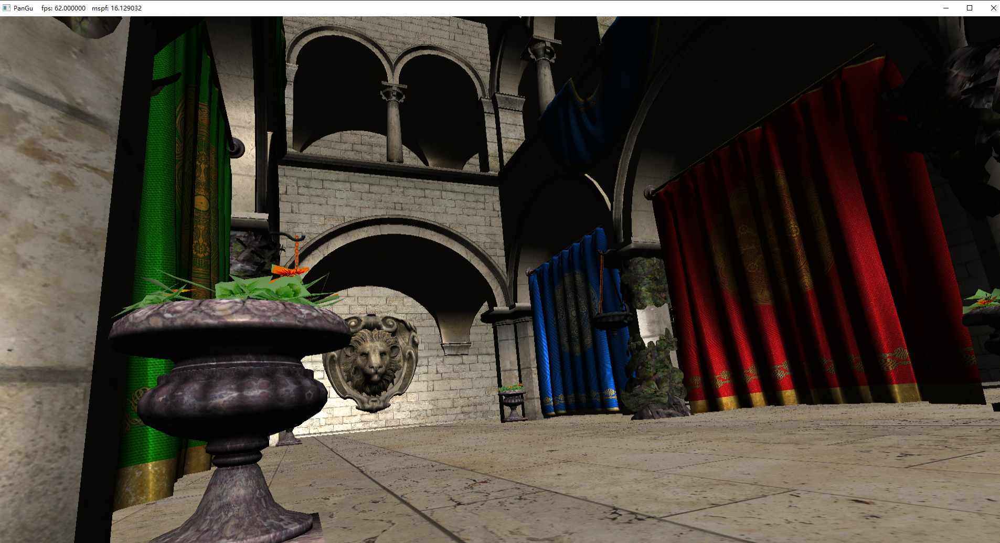
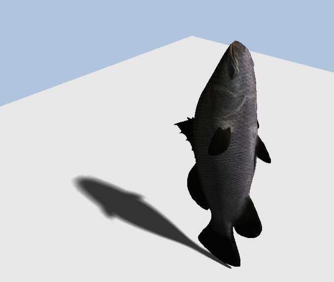

# PanGuEngine
A Rendering Engine based on Direct3D 12  
Development Log：https://www.zhihu.com/column/c_1159801832779427840
## Requirement
- Windows SDK 10.0.19041.0
- C++ 17
## Feature： 

### Direct3D Render Hadrware Interface(D3D12RHI)
- [x] Shader Resource Binding System 
- [x] Resource State Tracking System 
- [x] Dynamic Resource
- [ ] Async Compute
- [ ] Multi thread Rendering 

### Shading
- [x] Physically Based Shading 
- [ ] Image based Lighting
- [x] Percentage-Closer Soft Shadows 
- [ ] Cascaded Shadow Mapping
- [ ] Volumetric Rendering: Fog/Light/Cloud
- [ ] Sky Atmosphere
- [ ] Realtime Global Illumination
- [ ] Post process based on Compute Shader

### Pipeline
- [x] Forward Renderer 
- [ ] Deferred Renderer 
- [ ] GPU Driven Pipeline 
- [ ] Frame Graph 

PCSS 

